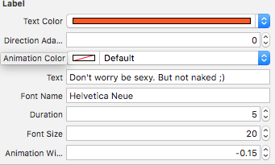

# MKLabel

## Usage
To see it in action, run the example project, clone the repo, from the `Example` directory. The example project shows how to set up `MKLabel` in Storyboard.

### Storyboard
Drag a `UIView` object and set the class to `MKLabel` (if needed set the module to `MKLabel` too).

You can now customize all the properties in IB such as the `textColor`, `animationColor`, `fontName` and so on. 

## License

`MKLabel` is available under the MIT license. See the [LICENSE](LICENSE) file for more info.
